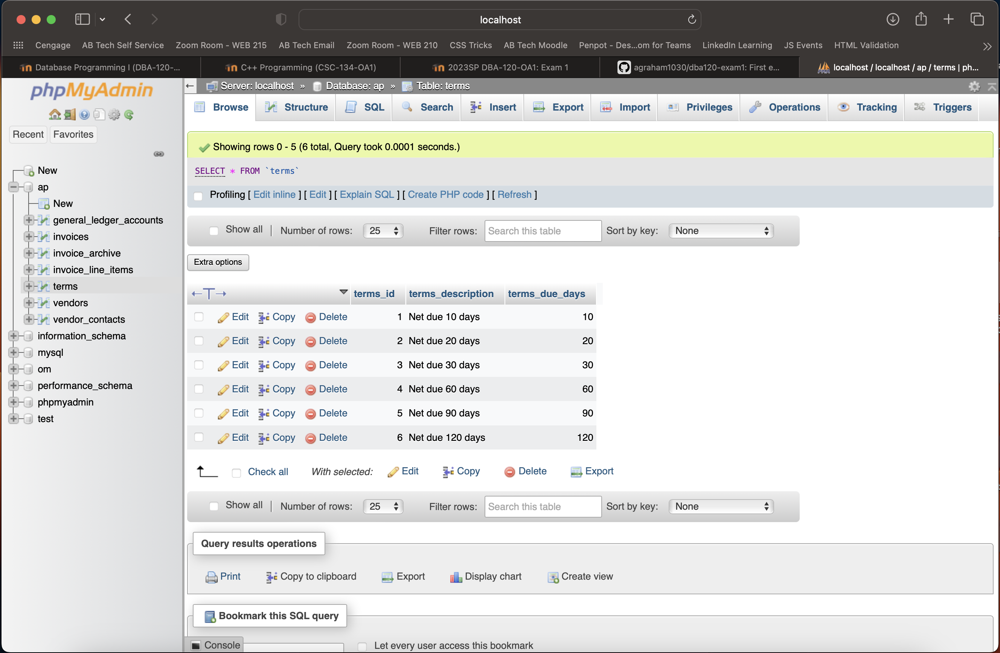

# dba120-exam1

## Ex. 1
[ch5_ex1.sql](ch5_ex1.sql)

```
INSERT INTO
  terms (terms_id, terms_description, terms_due_days)
VALUES
  ('6', 'Net due 120 days', '120');
```

The SQL query added a record to the terms table.



