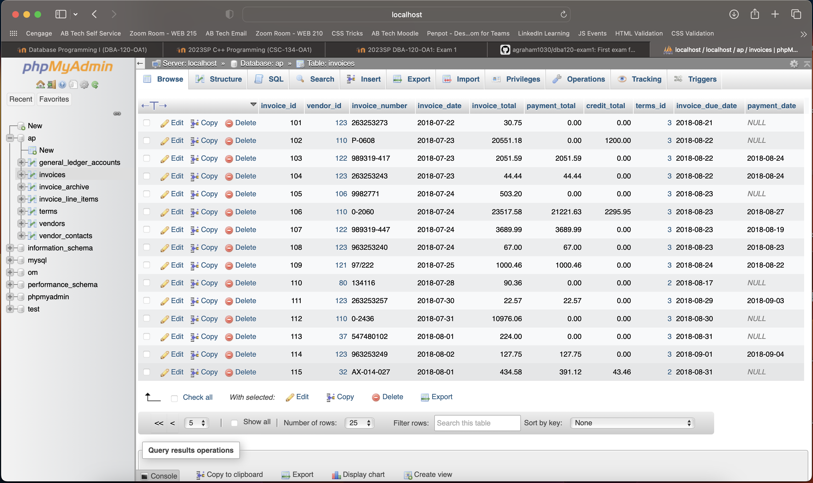

# dba120-exam1

## Ex. 1
[ch5_ex1.sql](ch5_ex1.sql)

```
INSERT INTO
  terms (terms_id, terms_description, terms_due_days)
VALUES
  ('6', 'Net due 120 days', '120');
```

The SQL query added a record to the terms table.


## Ex. 2
[ch5_ex2.sql](ch5_ex2.sql)

```
UPDATE
  terms
SET
  terms_description = 'Net due 125 days',
  terms_due_days = '125'
WHERE
  terms_id = 6;
```

The SQL query updated a record in the terms table.


## Ex. 3
[ch5_ex3.sql](ch5_ex3.sql)

```
DELETE FROM
  terms
WHERE
  terms_id = 6;
```

The SQL query deleted a record from the terms table.


## Ex. 4
[ch5_ex4.sql](ch5_ex4.sql)

```
INSERT INTO
  invoices
VALUES
  (default, 32, 'AX-014-027', '2018-08-01', 434.58, 0.00, 0.00,2, '2018-08-31', null);
```

The SQL query created a record in the invoices table.


## Ex. 5
[ch5_ex5.sql](ch5_ex5.sql)

```
INSERT INTO
  invoice_line_items
VALUES
  (115, 1, 160, 180.23, 'Hard drive'),
  (115, 2, 527, 254.35, 'Exchange Server update');
```

The SQL query created two records in the invoice_line_items table.


## Ex. 6
[ch5_ex6.sql](ch5_ex6.sql)

```
UPDATE
  invoices
SET
  credit_total = invoice_total *.1,
  payment_total = invoice_total - credit_total
WHERE
  invoice_id = 115;
```

The SQL query updated the invoices table with new numbers in the record with invoice id 115.




## Ex. 7
[ch5_ex7.sql](ch5_ex7.sql)

```
UPDATE
  vendors
SET
  default_account_number = 403
WHERE
  vendor_id = 44;
```

The SQL query updated the vendors table with a new default account number for the record with vendor id 44.


## Ex. 8
[ch5_ex8.sql](ch5_ex8.sql)

```
UPDATE
  invoices
SET
  terms_id = 2
WHERE
  vendor_id IN (
    SELECT
      vendor_id
    FROM
      vendors
    WHERE
      default_terms_id = 2
  );
```

The SQL query updated the invoices table based on information in the vendors table.


## Ex. 9
[ch5_ex9.sql](ch5_ex9.sql)

```
DELETE FROM
  invoice_line_items
WHERE
  invoice_id = 115;

DELETE FROM
  invoices
WHERE
  invoice_id = 115;
```

The SQL query deleted records from the invoice_line_items and invoices tables.


